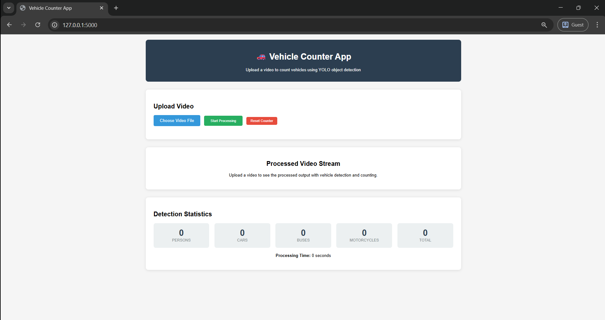
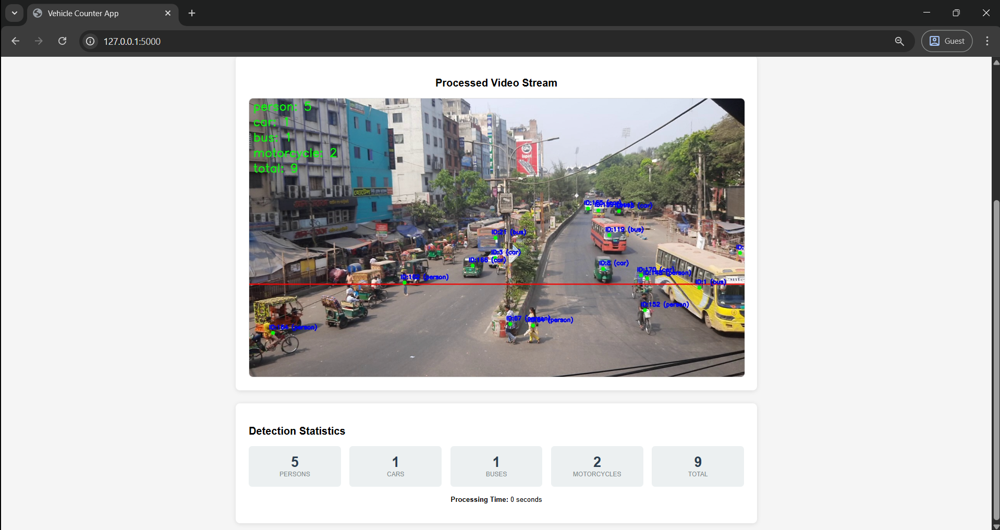
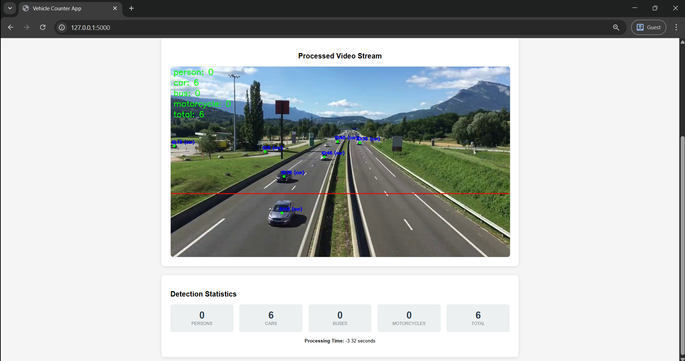

# Vehicle Counter Flask App

A web-based vehicle counting application using YOLOv8 object detection and Flask.

## Screenshots

### Home Page


### Processed Video Stream Example 1


### Processed Video Stream Example 2


## Sample Inputs

Sample screenshots above show the app running on localhost with different video inputs. The app overlays detection results and statistics in real time.

## Features

- Upload video files through web interface
- Real-time vehicle detection and counting
- Supports detection of: persons, cars, buses, motorcycles
- Live video stream with detection overlays
- Real-time statistics display
- Object tracking with unique IDs


## Quick Start (Windows)

To quickly start the app on Windows, you can use the provided batch script:

1. Double-click `run.bat` in the project folder, or run it from the command prompt:
   ```bat
   run.bat
   ```
2. This will launch the Flask app and display instructions in the terminal.
3. Open your browser and go to [http://localhost:5000](http://localhost:5000)

---

## Installation

1. Install Python dependencies:
```bash
pip install -r requirements.txt
```

2. The application will automatically download the YOLOv8x model on first run if it is not present.

### Model Weights (yolov8x.pt)

The `yolov8x.pt` model file is not included in this repository due to its size and licensing. If you do not have this file, you can download it from the official Ultralytics YOLOv8 release page:

- [YOLOv8 Releases on GitHub](https://github.com/ultralytics/ultralytics/releases)

Or, you can use the following Python code to download it automatically:

```python
from ultralytics import YOLO
YOLO('yolov8x.pt')  # This will download the model if not present
```

Place the downloaded `yolov8x.pt` file in the project root directory.

## Usage

1. Run the Flask application:
```bash
python app.py
```

2. Open your browser and go to `http://localhost:5000`

3. Upload a video file using the web interface

4. Watch the processed video stream with vehicle detection and counting

5. View real-time statistics showing counts for each vehicle type

## API Endpoints

- `GET /` - Main web interface
- `POST /upload` - Upload video for processing
- `GET /stats` - Get current detection statistics
- `GET /reset` - Reset all counters

## Technical Details

- Uses YOLOv8x model for object detection
- Implements object tracking to avoid duplicate counting
- Processes video frames in real-time
- Streams processed video back to browser
- Stores uploaded video in memory (no disk storage)

## Supported Video Formats

- MP4, AVI, MOV, WMV, and other common video formats supported by OpenCV


## Requirements

- Python 3.8+
- Sufficient RAM for video processing
- GPU recommended for faster processing (optional)

## Contributing

Contributions are welcome! Please open an issue or submit a pull request for bug fixes, improvements, or new features. For major changes, please open an issue first to discuss what you would like to change.

## License

This project is licensed under the MIT License. See the [LICENSE](LICENSE) file for details.
